# Pentagram 클래스 다이어그램

이 문서는 `Source/Pentagram` 폴더의 주요 C++ 헤더를 기준으로 정리한 클래스 다이어그램입니다.
예시 이미지처럼 전체 구조를 한 장에서 볼 수 있도록 핵심 게임플레이 클래스, 컨트롤러, 컴포넌트, AI, 아이템, NPC, UI, 서브시스템 관계를 중심으로 묶었습니다.

```mermaid
classDiagram
direction LR

class AActor
class ACharacter
class APlayerController
class APlayerState
class AGameModeBase
class AGameStateBase
class AAIController
class UActorComponent
class UGameInstanceSubsystem
class ULocalPlayerSubsystem
class USaveGame
class UUserWidget
class UCommonUserWidget
class UCommonActivatableWidget
class UAnimInstance
class UAnimNotify
class UAnimNotifyState
class UBTTaskNode
class UBTTask_MoveTo
class UBTService
class UEnvQueryContext

class IPTInteractableInterface {
  <<interface>>
  +Interact(AActor* InteractorCharacter)
}

class IPTUIContentBoundsInterface {
  <<interface>>
}

class APTGameMode {
  +RequestLevelTransition(FName)
  +StartGame()
  +EndGame()
  +OnBossFightStarted()
  +OnBossDefeated()
  +RespawnPlayer(AController*)
  +DistributeExp(int32)
  +RequestTravelToGame()
  -QuestDataTable
  -LevelDataTable
  -ItemDataTable
}

class APTStartupGameMode

class APTGameState {
  +SetCurrentPhase(EGamePhase)
  +GetCurrentPhase() EGamePhase
  +SetQuestDataTable(UDataTable*)
  +SetItemDataTable(UDataTable*)
  +Server_AddChatMessage()
  +OnLobbyUpdated
  +OnChatMessageReceived
  -CurrentPhase
  -QuestDataTable
  -ItemDataTable
  -ChatLog
}

class APTBasePlayerState {
  +BroadcastAllStats()
  +SetSavedRespawnLocation(FVector)
  +SetReady(bool)
  +CurrentHP
  +MaxHP
  +CurrentMP
  +MaxMP
  +BaseAtk
  +BaseDef
  +CurrentGold
  +CurrentExp
  +PlayerLevel
  +AcceptedQuests
}

class APTPlayerController {
  +SetupInputComponent()
  +AcknowledgePossession(APawn*)
  +Server_TryPickupItem(APTDropItemActorBase*)
  +Server_RequestAssignSkillToSlot(FName, int32)
  +Client_OpenQuestDialogue()
  +Client_OpenShop()
  +Client_ShowMonsterHealth(APTMonsterCharacter*)
  +Client_ShowDeathMenu()
  +HandleSkillPressed(int32)
  +BeginSkillAim(int32)
  -PrimaryLayout
  -NearbyNPCs
  -NearbyInteractionActors
  -IndicatorActor
}

class APTBaseCharacter {
  +ApplyDamage(float, AActor*) float
  +ApplyDamageWithHit(float, AActor*, FPTHitInfo) float
  +OnDeath()
  +IsDead() bool
  +SyncCombatStatsToPlayerState()
  +CharacterType
  +CurrentHP
  +MaxHP
  +CurrentMP
  +MaxMP
  +BaseAtk
  +BaseDef
  +AttackSpeed
  +MoveSpeed
}

class APTPlayerCharacter {
  +TryInteract()
  +Server_TryInteract(AActor*)
  +Server_UseSkill(FName, FVector, FVector, AActor*)
  +RespawnAtLocation(FVector)
  +UpdateWeaponVisual()
  +ApplyBuff(float, float)
  +EnterCombat()
  +GetInventoryComponent() UPTInventoryComponent*
  +GetEquipmentComponent() UPTEquipmentComponent*
  +SpringArmComp
  +CameraComp
  +SkillComp
  +InventoryComponent
  +EquipmentComponent
  +WeaponMeshComp
  +HelmetMeshComp
}

class APTMonsterCharacter {
  +InitializeMonster()
  +SetMonsterState(EMonsterState)
  +PerformAttack()
  +StartAttack() float
  +StopAttack()
  +GetRewardData() FPTMonsterRewardData
  +SkillComponent
  +CurrentState
  +AttackMontage
  +DeathMontage
  +ProjectileClass
  +GoldPickupClass
  +EquipmentDropClass
}

class APTBossMonsterCharacter {
  +PerformAttack()
  +GetCurrentPhase() int32
  +GetDamageMultiplierForPhase(int32) float
  +GetBossPatternComponent() UPTBossPatternComponent*
  +OnShieldDestroyed()
  +BossPatternComponent
  +RoomCenterActor
  -ShieldClass
  -ActiveShield
}

class UPTInventoryComponent {
  +TryAddItem(FItemData, int32) bool
  +CanAddItem(FItemData, int32) bool
  +RemoveItem(FName, int32) bool
  +UseItemAtSlot(int32) bool
  +RegisterConsumableToQuickSlot(int32, int32) bool
  +InventorySlots
  +QuickSlots
  +OnInventoryChanged
}

class UPTEquipmentComponent {
  +EquipItem(FItemData, FItemData&) bool
  +UnequipItem(EEquipSlotType, FItemData&) bool
  +GetEquippedWeaponType() EWeaponType
  +GetEquipmentSlots() TArray
  +EquippedWeapon
  +EquippedChest
  +EquippedHelmet
  +EquippedGloves
  +EquippedBoots
}

class UPTSkillComponent {
  +TryActivateSkill(FPTSkillActivationRequest)
  +TryActivateSkillChecked(FPTSkillActivationRequest) bool
  +AssignSkillToSlot(FName, int32)
  +GetSkillAtSlot(int32) FName
  +GetCooldownRemaining(int32) float
  +GetSkillData(FName) FPTSkillRow*
  +SkillDataTable
  +SkillSlots
  +TargetLocation
  +TargetActor
}

class UPTPlayerSkillComponent {
  +TryDodge()
  +TryBasicAttack()
  +TryActivateSkillBySlot(int32)
  +LearnSkill(FName) bool
  +CanUseSkill(FPTSkillRow, FText&) bool
  +ApplyRadialDamageAtLocation()
  +ApplyTargetedDamage()
  +LearnedSkills
  +ComboIndex
  +OnSkillCooldownStart
  +OnSkillSlotAssigned
}

class UPTMonsterSkillComponent {
  +PerformBasicAttack() bool
  +CanAttack() bool
  +BasicAttackRowName
}

class UPTBossPatternComponent {
  +StartPattern()
  +FireProjectile()
  +StartLaser()
  +SpawnAreaWarning()
  +BossSkillDataTable
  +ProjectileClass
  +SkillComponent
  +ActiveLaserComponent
}

class APTPlayerProjectileActor
class APTMeteorActor
class APTSkillIndicatorActor
class APTBossProjectile {
  +InitializeProjectile()
  +CollisionComp
  +ProjectileMovement
  +NiagaraComp
  +MeshComp
}

class APTAreaWarning {
  +InitializeWarning()
  +SceneRoot
  +FallEffectComp
  +WarningMesh
  +BorderMesh
}

class APTBossShield {
  +InitializeShield()
  +ShieldMeshComp
  +ShieldRadius
  +PushForce
}

class APTBossRoomCenter

class APTNPCCharacter {
  +Interact(AActor*)
  +GetNPCID() FName
  +SceneRootComponent
  +MeshComponent
  +InteractionRangeSphere
  +InteractionPromptWidgetComponent
}

class APTQuestNPCCharacter {
  +Interact(AActor*)
  +GetQuestIDs() TArray
  +QuestDialogueWidgetClass
}

class APTShopNPCCharacter {
  +Interact(AActor*)
  +OpenShop(APlayerController*)
  +CloseShop(APlayerController*)
  +GetProductIDs() TArray
  +ShopWidgetClass
}

class APTInteractionActor {
  +Interact(AActor*)
  +ActorMesh
  +InteractionRangeSphere
  +InteractionPromptWidgetComponent
  +InteractionType
  +RewardItemID
}

class APTLevelTrigger
class APTLevelTriggerVolume
class APTDropItemActorBase {
  +CollisionSphere
  +ItemMesh
  +ItemNameWidgetComponent
  +ItemRowHandle
  +InstanceItemData
}
class APTGoldPickup {
  +GoldMesh
  +CollisionSphere
  +GoldAmount
}

class APTBaseAIController {
  +UpdateSightConfig(float, float, float)
  #OnPossess(APawn*)
  #OnTargetPerceptionUpdated(AActor, FAIStimulus)
  #BehaviorTree
  -SightConfig
}
class APTMonsterAIController
class APTBossAIController {
  -CachedPhase
}
class UPTBTTask_Attack
class UPTBTTask_MoveToTarget
class UPTBTTask_Patrol
class UPTBTTask_TurnToTarget
class UPTBTTask_ClearLastKnownLocation
class UPTBTService_MonsterSensor
class UPTBTService_BossSensor
class UPTBTService_BossPhase
class UPTBTService_LaserOnApproach
class UPTEQS_Target
class UPTEQS_Home
class UPTEQS_BossRoom

class UPTPlayerAnimInstance
class UPTMonsterAnimInstance
class UPTAnimNotify_AttackHit
class UPTAnimNotify_AttackEnd
class UPTAnimNotify_FireProjectile
class UPTAnimNotify_SpawnMeteor
class UPTAnimNotify_SkillHit
class UPTAnimNotifyState_SkillDash
class UPTAnimNotifyState_SkillProjectile
class UPTAnimNotifyState_ComboAttack
class UPTMeleeHitNotifyState

class UPTHUDWidget
class UPTPrimaryLayout {
  +GameLayer
  +MenuLayer
  +ModalLayer
}
class UPTPlayerStatusWidget
class UPTStatBarWidget
class UPTHealthBarwidget
class UPTManaBarWidget
class UPTExpBarWidget
class UPTInventoryWidget
class UPTInventorySlotWidget
class UPTEquipPanelWidget
class UPTEquipSlotWidget
class UPTSkillWindowWidget
class UPTSkillSlotWidget
class UPTSkillSlotEntryWidget
class UPTNPCDialogueWidget
class UPTQuestListEntryWidget
class UPTShopWidget
class UPTShopSlotWidget
class UPTItemInfoPanel
class UPTMonsterHealthBarWidget
class UPTDeathMenuWidget
class UPTSettingsWidget
class UPTLobbyWidget
class UPTChatWidget
class UPTNotifyManagerWidget
class UPTLoadingWidget
class UPTCharacterSheetWidget

class UPTQuestSubsystem {
  +InitializeQuestData()
  +AcceptQuest()
  +RewardQuest()
}
class UPTRewardSubsystem
class UPTItemSubsystem
class UPTEconomySubsystem
class UPTPlayerLevelSubsystem
class UPTSaveSubsystem
class UPTSaveGame
class UPTLoadingSubsystem
class UPTOnlineSubsystem
class UPTAudioSubsystem
class UPTControlSettingsSubsystem
class UPTUIManagerSubsystem

AGameModeBase <|-- APTGameMode
APTGameMode <|-- APTStartupGameMode
AGameStateBase <|-- APTGameState
APlayerState <|-- APTBasePlayerState
APlayerController <|-- APTPlayerController

ACharacter <|-- APTBaseCharacter
APTBaseCharacter <|-- APTPlayerCharacter
APTBaseCharacter <|-- APTMonsterCharacter
APTMonsterCharacter <|-- APTBossMonsterCharacter

UActorComponent <|-- UPTInventoryComponent
UActorComponent <|-- UPTEquipmentComponent
UActorComponent <|-- UPTSkillComponent
UPTSkillComponent <|-- UPTPlayerSkillComponent
UPTSkillComponent <|-- UPTMonsterSkillComponent
UActorComponent <|-- UPTBossPatternComponent

APTPlayerCharacter *-- UPTPlayerSkillComponent : SkillComp
APTPlayerCharacter *-- UPTInventoryComponent : InventoryComponent
APTPlayerCharacter *-- UPTEquipmentComponent : EquipmentComponent
APTMonsterCharacter *-- UPTMonsterSkillComponent : SkillComponent
APTBossMonsterCharacter *-- UPTBossPatternComponent : BossPatternComponent
APTBossMonsterCharacter o-- APTBossRoomCenter : RoomCenterActor
APTBossMonsterCharacter o-- APTBossShield : ActiveShield
UPTBossPatternComponent --> UPTMonsterSkillComponent : uses
UPTBossPatternComponent --> APTBossProjectile : spawns
UPTBossPatternComponent --> APTAreaWarning : spawns

AActor <|-- APTPlayerProjectileActor
AActor <|-- APTMeteorActor
AActor <|-- APTSkillIndicatorActor
AActor <|-- APTBossProjectile
AActor <|-- APTAreaWarning
APTBaseCharacter <|-- APTBossShield
AActor <|-- APTBossRoomCenter

AActor <|-- APTNPCCharacter
APTNPCCharacter <|-- APTQuestNPCCharacter
APTNPCCharacter <|-- APTShopNPCCharacter
IPTInteractableInterface <|.. APTNPCCharacter
AActor <|-- APTInteractionActor
IPTInteractableInterface <|.. APTInteractionActor
APTInteractionActor <|-- APTLevelTrigger
AActor <|-- APTLevelTriggerVolume
AActor <|-- APTDropItemActorBase
AActor <|-- APTGoldPickup

APTPlayerController --> APTPlayerCharacter : possesses / controls
APTPlayerController --> APTBasePlayerState : reads / updates
APTPlayerController --> APTNPCCharacter : nearby interaction
APTPlayerController --> APTInteractionActor : nearby interaction
APTPlayerController --> APTDropItemActorBase : pickup / drop
APTPlayerController --> APTMonsterCharacter : target UI
APTGameMode --> APTBasePlayerState : initialize / save
APTGameMode --> APTGameState : phase / lobby
APTMonsterCharacter --> APTBasePlayerState : exp contributors
APTMonsterCharacter --> APTGoldPickup : drops
APTMonsterCharacter --> APTDropItemActorBase : drops

AAIController <|-- APTBaseAIController
APTBaseAIController <|-- APTMonsterAIController
APTBaseAIController <|-- APTBossAIController
APTBossAIController --> APTBossMonsterCharacter : controls
APTMonsterAIController --> APTMonsterCharacter : controls
UBTTaskNode <|-- UPTBTTask_Attack
UBTTaskNode <|-- UPTBTTask_TurnToTarget
UBTTaskNode <|-- UPTBTTask_ClearLastKnownLocation
UBTTask_MoveTo <|-- UPTBTTask_MoveToTarget
UBTTask_MoveTo <|-- UPTBTTask_Patrol
UBTService <|-- UPTBTService_MonsterSensor
UBTService <|-- UPTBTService_BossSensor
UBTService <|-- UPTBTService_BossPhase
UBTService <|-- UPTBTService_LaserOnApproach
UEnvQueryContext <|-- UPTEQS_Target
UEnvQueryContext <|-- UPTEQS_Home
UEnvQueryContext <|-- UPTEQS_BossRoom

UAnimInstance <|-- UPTPlayerAnimInstance
UAnimInstance <|-- UPTMonsterAnimInstance
UAnimNotify <|-- UPTAnimNotify_AttackHit
UAnimNotify <|-- UPTAnimNotify_AttackEnd
UAnimNotify <|-- UPTAnimNotify_FireProjectile
UAnimNotify <|-- UPTAnimNotify_SpawnMeteor
UAnimNotify <|-- UPTAnimNotify_SkillHit
UAnimNotifyState <|-- UPTAnimNotifyState_SkillDash
UAnimNotifyState <|-- UPTAnimNotifyState_SkillProjectile
UAnimNotifyState <|-- UPTAnimNotifyState_ComboAttack
UAnimNotifyState <|-- UPTMeleeHitNotifyState

UUserWidget <|-- UPTHUDWidget
UCommonUserWidget <|-- UPTPrimaryLayout
UCommonUserWidget <|-- UPTPlayerStatusWidget
UCommonUserWidget <|-- UPTStatBarWidget
UPTStatBarWidget <|-- UPTHealthBarwidget
UPTStatBarWidget <|-- UPTManaBarWidget
UPTStatBarWidget <|-- UPTExpBarWidget
UCommonActivatableWidget <|-- UPTInventoryWidget
UCommonUserWidget <|-- UPTInventorySlotWidget
UCommonUserWidget <|-- UPTEquipPanelWidget
UCommonUserWidget <|-- UPTEquipSlotWidget
UCommonActivatableWidget <|-- UPTSkillWindowWidget
UCommonUserWidget <|-- UPTSkillSlotWidget
UCommonUserWidget <|-- UPTSkillSlotEntryWidget
UCommonActivatableWidget <|-- UPTNPCDialogueWidget
UUserWidget <|-- UPTQuestListEntryWidget
UCommonActivatableWidget <|-- UPTShopWidget
UCommonUserWidget <|-- UPTShopSlotWidget
UCommonUserWidget <|-- UPTItemInfoPanel
UCommonUserWidget <|-- UPTMonsterHealthBarWidget
UCommonActivatableWidget <|-- UPTDeathMenuWidget
UCommonActivatableWidget <|-- UPTSettingsWidget
UCommonUserWidget <|-- UPTLobbyWidget
UCommonUserWidget <|-- UPTChatWidget
UCommonUserWidget <|-- UPTNotifyManagerWidget
UUserWidget <|-- UPTLoadingWidget
UCommonActivatableWidget <|-- UPTCharacterSheetWidget
IPTUIContentBoundsInterface <|.. UPTCharacterSheetWidget

UPTPlayerStatusWidget *-- UPTHealthBarwidget : HealthBar
UPTPlayerStatusWidget *-- UPTManaBarWidget : ManaBar
UPTPlayerStatusWidget *-- UPTExpBarWidget : ExpBar
UPTInventoryWidget --> UPTInventoryComponent : displays
UPTInventoryWidget *-- UPTInventorySlotWidget : slots
UPTEquipPanelWidget *-- UPTEquipSlotWidget : slots
UPTSkillWindowWidget --> UPTPlayerSkillComponent : displays / assigns
UPTSkillSlotWidget *-- UPTSkillSlotEntryWidget : Q/W/E/R
UPTNPCDialogueWidget --> APTQuestNPCCharacter : TargetNPC
UPTShopWidget --> APTShopNPCCharacter : TargetShopNPC
UPTShopWidget *-- UPTShopSlotWidget : products
UPTShopWidget *-- UPTItemInfoPanel : preview
UPTCharacterSheetWidget --> APTBasePlayerState : stats
UPTMonsterHealthBarWidget --> APTMonsterCharacter : target

UGameInstanceSubsystem <|-- UPTQuestSubsystem
UGameInstanceSubsystem <|-- UPTRewardSubsystem
UGameInstanceSubsystem <|-- UPTItemSubsystem
UGameInstanceSubsystem <|-- UPTEconomySubsystem
UGameInstanceSubsystem <|-- UPTPlayerLevelSubsystem
UGameInstanceSubsystem <|-- UPTSaveSubsystem
UGameInstanceSubsystem <|-- UPTLoadingSubsystem
UGameInstanceSubsystem <|-- UPTOnlineSubsystem
UGameInstanceSubsystem <|-- UPTAudioSubsystem
UGameInstanceSubsystem <|-- UPTUIManagerSubsystem
ULocalPlayerSubsystem <|-- UPTControlSettingsSubsystem
USaveGame <|-- UPTSaveGame

UPTQuestSubsystem --> APTBasePlayerState : quest progress
UPTRewardSubsystem --> UPTEconomySubsystem : gold reward
UPTRewardSubsystem --> UPTPlayerLevelSubsystem : exp reward
UPTItemSubsystem --> UPTInventoryComponent : item data
UPTSaveSubsystem --> UPTSaveGame : serializes
UPTLoadingSubsystem --> UPTLoadingWidget : status
UPTUIManagerSubsystem --> UPTPrimaryLayout : layer stack
```

## 읽는 법

- 빈 삼각형 화살표(`<|--`)는 상속 관계입니다.
- 검은 마름모(`*--`)는 소유/컴포넌트 관계입니다.
- 흰 마름모(`o--`)는 참조 또는 약한 소유 관계입니다.
- 점선 구현 화살표(`<|..`)는 인터페이스 구현 관계입니다.
- UI 세부 버튼, 텍스트, 이미지 컴포넌트는 다이어그램이 지나치게 커지는 것을 막기 위해 대표 위젯 관계만 표시했습니다.

## 핵심 구조 요약

- 캐릭터 계층은 `APTBaseCharacter`를 중심으로 플레이어, 몬스터, 보스가 갈라집니다.
- 플레이어는 `UPTPlayerSkillComponent`, `UPTInventoryComponent`, `UPTEquipmentComponent`를 직접 소유합니다.
- 몬스터는 `UPTMonsterSkillComponent`를 소유하고, 보스는 추가로 `UPTBossPatternComponent`와 쉴드/보스룸 액터를 참조합니다.
- `APTPlayerController`는 입력, 스킬 조준, NPC/상호작용, 아이템 픽업, UI 열기 요청을 처리합니다.
- `APTGameMode`와 `APTGameState`는 게임 페이즈, 로비, 레벨 전환, 리스폰, 보상 분배의 중심입니다.
- AI는 `APTBaseAIController`를 기반으로 몬스터/보스 컨트롤러가 나뉘며, BT Task/Service/EQS 클래스가 행동을 보조합니다.
- UI는 `UPTPrimaryLayout`의 레이어 스택 위에 인벤토리, 스킬, NPC, 상점, 상태창, 로비/채팅, 알림, 로딩 위젯이 올라가는 구조입니다.
